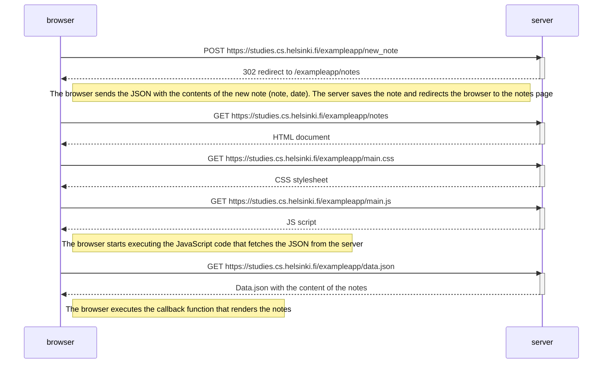

```mermaid
sequenceDiagram
    participant browser
    participant server

    browser->>server: POST https://studies.cs.helsinki.fi/exampleapp/new_note 
    activate server
    server-->>browser: 302 redirect to /exampleapp/notes
    deactivate server

    Note right of browser: The browser sends the JSON with the contents of the new note (note, date). The server saves the note and redirects the browser to the notes page


    browser->>server: GET https://studies.cs.helsinki.fi/exampleapp/notes
    activate server
    server-->>browser: HTML document
    deactivate server

    browser->>server: GET https://studies.cs.helsinki.fi/exampleapp/main.css
    activate server
    server-->>browser: CSS stylesheet
    deactivate server


    browser->>server: GET https://studies.cs.helsinki.fi/exampleapp/main.js
    activate server
    server-->>browser: JS script
    deactivate server

    Note right of browser: The browser starts executing the JavaScript code that fetches the JSON from the server

   browser->>server: GET https://studies.cs.helsinki.fi/exampleapp/data.json
    activate server
    server-->>browser: Data.json with the content of the notes
    deactivate server
    
    Note right of browser: The browser executes the callback function that renders the notes
```
