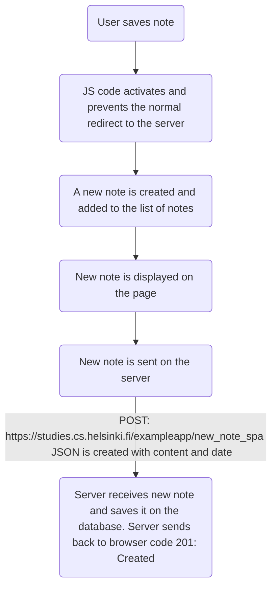

```mermaid
flowchart TD
    A(User saves note) --> B(JS code activates and prevents the normal redirect to the server)
    B --> C(A new note is created and added to the list of notes)
    C--> D(New note is displayed on the page)
    D--> E(New note is sent on the server)
    E--> |POST: https://studies.cs.helsinki.fi/exampleapp/new_note_spa 
    JSON is created with content and date| F(Server receives new note and saves it on the database. Server sends back to browser code 201: Created)
```
