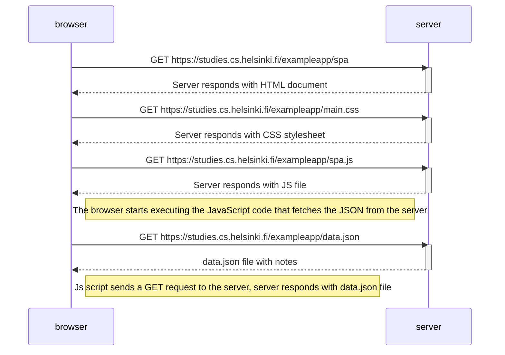

```mermaid
sequenceDiagram
    participant browser
    participant server

    browser->>server: GET https://studies.cs.helsinki.fi/exampleapp/spa
    activate server
    server-->>browser: Server responds with HTML document
    deactivate server

    browser->>server: GET https://studies.cs.helsinki.fi/exampleapp/main.css
    activate server
    server-->>browser: Server responds with CSS stylesheet
    deactivate server

    browser->>server: GET https://studies.cs.helsinki.fi/exampleapp/spa.js
    activate server
    server-->>browser: Server responds with JS file
    deactivate server

 Note right of browser: The browser starts executing the JavaScript code that fetches the JSON from the server

   browser->>server: GET https://studies.cs.helsinki.fi/exampleapp/data.json
    activate server
    server-->>browser:  data.json file with notes
    deactivate server
    
    Note right of browser: Js script sends a GET request to the server, server responds with data.json file
```
